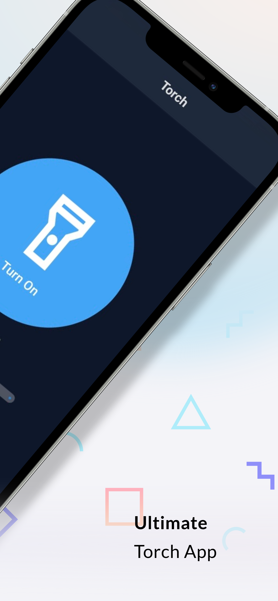
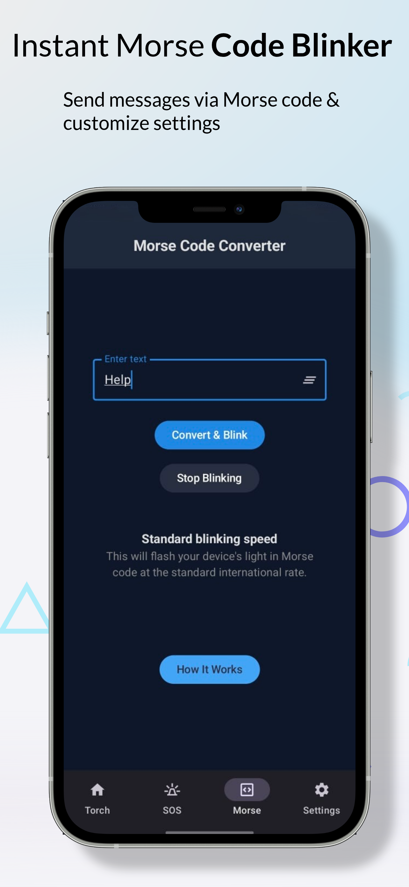

# 🔦 Torchly – Smart Flashlight & Morse Code Utility (Android)

Torchly is a modern Android flashlight application built entirely using Jetpack Compose.  
Beyond basic torch functionality, it integrates Morse code encoding, SOS signaling, shake detection, and haptic feedback for an interactive system-level experience.

---

## 🚀 Features

- Basic flashlight toggle
- Convert any text into Morse code blink patterns
- Automatic SOS signal flashing
- Haptic feedback synchronized with flash
- Shake-to-toggle flashlight
- Flash on/off animation using Compose
- Adjustable vibration control via settings

---

## 🛠 Tech Stack

- Kotlin
- Jetpack Compose
- CameraManager (Torch control)
- SensorManager (Shake detection)
- Haptic Feedback APIs
- SharedPreferences (Settings persistence)

---

## ⚙️ Core Functionality

### 🔦 Flash Control
- Uses `CameraManager` to directly control device torch hardware
- Handles runtime permission management
- Optimized for fast toggle response

### 📡 Morse Code Engine
- Converts user input into Morse code sequences
- Blinks torch in timed dot/dash intervals
- Supports SOS quick trigger

### 📱 Motion Detection
- Shake detection implemented using `SensorManager`
- Adjustable sensitivity
- Allows quick access without touching screen

### 🎛 State Persistence
- User preferences stored using SharedPreferences
- Settings retained across app restarts

### ⏱ Auto Shut-Off Timer
- User-selectable auto-off duration (2, 5, or 10 minutes)
- Automatically disables torch to prevent battery drain
- Implemented using timed background execution

---

## 🧠 Concepts Demonstrated

- Hardware-level Android APIs
- Sensor event handling
- Coroutine timing control
- Compose state management
- Background-safe hardware interaction

---

## ▶️ How to Run

1. Clone repository
2. Open in Android Studio
3. Sync Gradle
4. Run on physical device (flash required)

---

## 📌 Why This Project Matters

Torchly demonstrates:

- Direct hardware interaction
- Real-time sensor processing
- Modern UI development with Compose
- Event-driven architecture
- State persistence and user configuration handling

---

## 📸 Screenshots

## 🔦 Torch Home Screens

| Torch Screen 1                          | Torch Screen 2                          |
|-----------------------------------------|-----------------------------------------|
|  |  |

### 🚨 SOS Mode

### 📡 Morse Code Converter

### ⚙️ Settings

